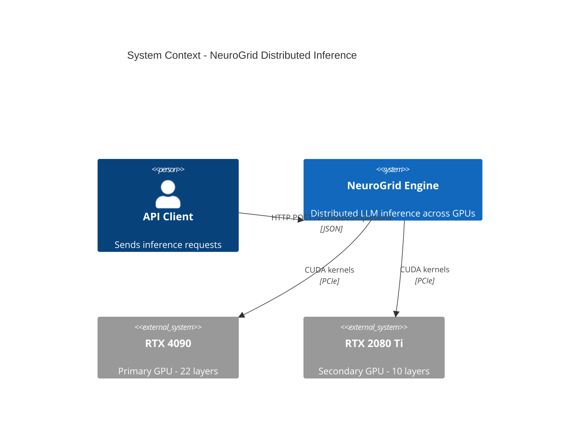
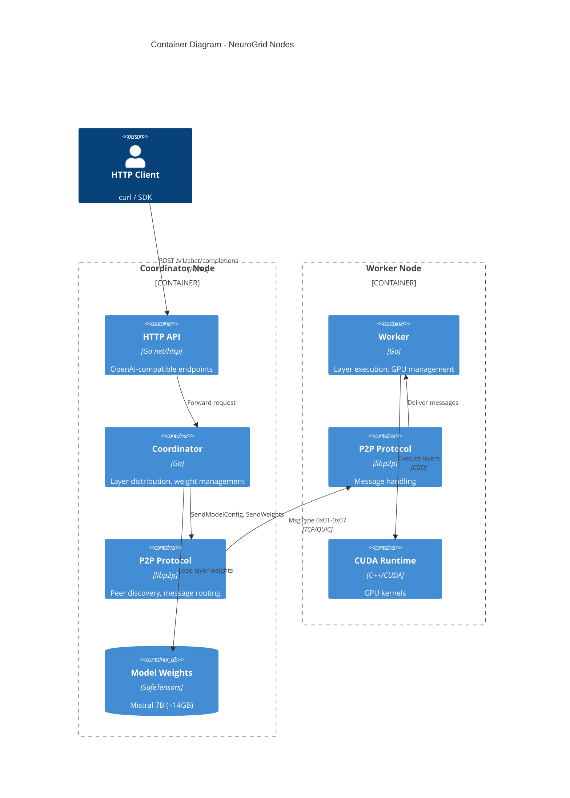
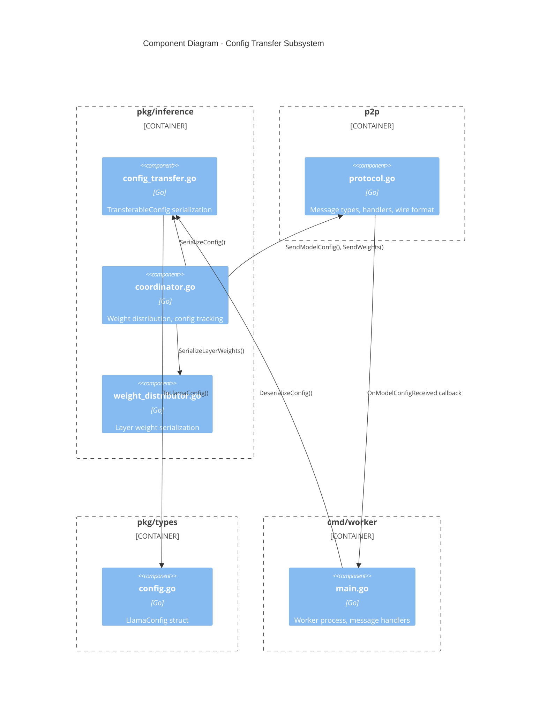
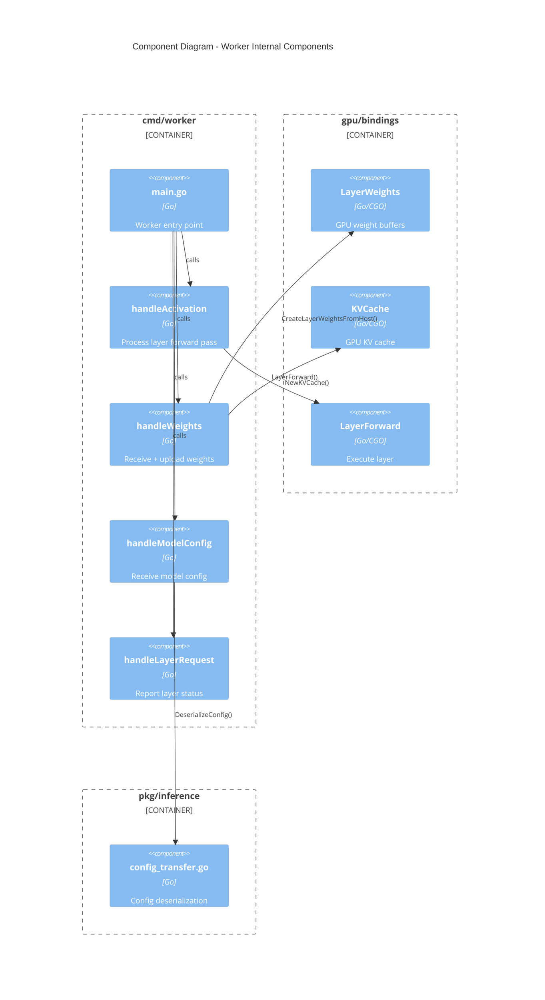
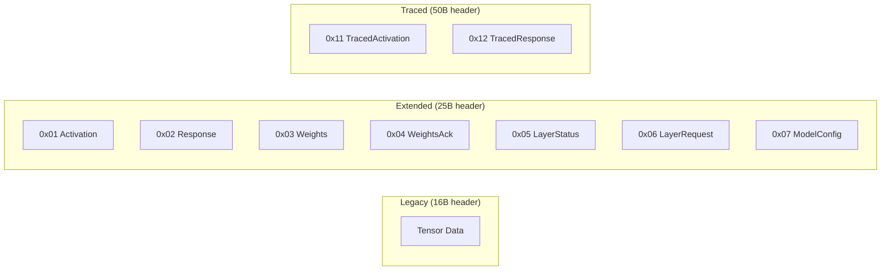
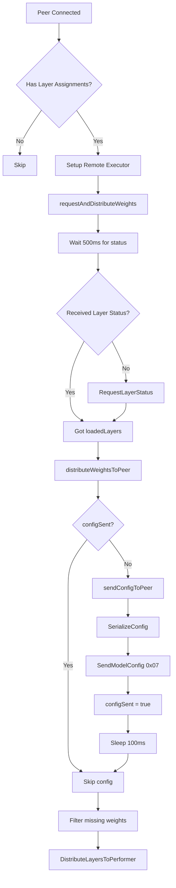
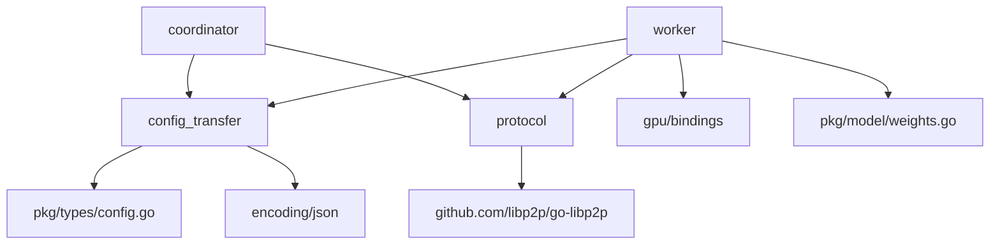
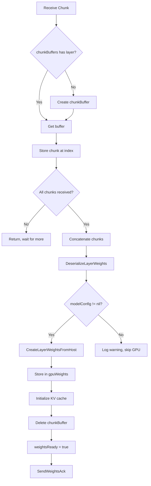

# C4 Component Diagram: Hybrid Distributed Inference System

## Overview

This diagram shows the internal components of the NeuroGrid distributed inference system, focusing on the hybrid worker model that supports both stateful (local model) and stateless (config transfer) operation modes.

## C4 Context

## C4 Container

## C4 Component - Config Transfer

## C4 Component - Worker Internal

## Components

### Config Transfer Components

| Component | File | Responsibility |
|-----------|------|----------------|
| TransferableConfig | `pkg/inference/config_transfer.go` | JSON-serializable model config struct |
| SerializeConfig | `pkg/inference/config_transfer.go` | LlamaConfig -> JSON bytes |
| DeserializeConfig | `pkg/inference/config_transfer.go` | JSON bytes -> LlamaConfig |
| FromLlamaConfig | `pkg/inference/config_transfer.go` | Type conversion helper |
| ToLlamaConfig | `pkg/inference/config_transfer.go` | Type conversion helper |

### Protocol Components

| Component | File | Responsibility |
|-----------|------|----------------|
| MsgTypeModelConfig | `p2p/protocol.go` | Message type constant (0x07) |
| ModelConfigHandler | `p2p/protocol.go` | Callback type for config messages |
| OnModelConfigReceived | `p2p/protocol.go` | Register config handler |
| SendModelConfig | `p2p/protocol.go` | Send config to peer |
| handleExtendedMessage | `p2p/protocol.go` | Route incoming messages |

### Coordinator Components

| Component | File | Responsibility |
|-----------|------|----------------|
| distributeWeightsToPeer | `pkg/inference/coordinator.go` | Orchestrate config + weight transfer |
| sendConfigToPeer | `pkg/inference/coordinator.go` | Send config before weights |
| configSent | `pkg/inference/coordinator.go` | Track which peers received config |
| modelName | `pkg/inference/coordinator.go` | Model name for serialization |
| shortPeerID | `pkg/inference/coordinator.go` | Helper for log formatting |

### Worker Components

| Component | File | Responsibility |
|-----------|------|----------------|
| handleModelConfig | `cmd/worker/main.go` | Process received config |
| handleWeights | `cmd/worker/main.go` | Receive weights, upload to GPU |
| handleActivation | `cmd/worker/main.go` | Execute layer forward pass |
| handleLayerRequest | `cmd/worker/main.go` | Report loaded layers |
| modelConfig | `cmd/worker/main.go` | Stored LlamaConfig for GPU ops |
| chunkBuffers | `cmd/worker/main.go` | Accumulate weight chunks |

## Protocol Message Types

## Hybrid Worker Modes

```mermaid
flowchart TB
    subgraph StatefulMode["Stateful Mode (--model flag)"]
        S1[Worker Start] --> S2[Load Local Model]
        S2 --> S3[Parse Config]
        S3 --> S4[Report LayerStatus]
        S4 --> S5[Ready for Inference]
    end

    subgraph StatelessMode["Stateless Mode (no --model)"]
        L1[Worker Start] --> L2[Wait for Config]
        L2 --> L3[Receive MsgTypeModelConfig]
        L3 --> L4[handleModelConfig - DeserializeConfig]
        L4 --> L5[Receive MsgTypeWeights]
        L5 --> L6[handleWeights - Upload to GPU]
        L6 --> L7[Ready for Inference]
    end
```

## Coordinator Config Flow

## Dependencies

## Worker Chunk Buffer Flow

## Related Documentation

- [ADR-006: Config Transfer Protocol](../decisions/ADR-006-config-transfer-protocol.md)
- [Sequence Diagram: Config Transfer](sequence-config-transfer.md)
- [Sequence Diagram: Worker Modes](sequence-worker-modes.md)
- [Data Flow: Config Transfer](data-flow-config-transfer.md)
- [P2P Networking Architecture](../p2p-networking.md)

---

*Updated 2025-01-24 - Added Phase 3-5 implementation details (coordinator sendConfigToPeer, worker handleModelConfig)*
