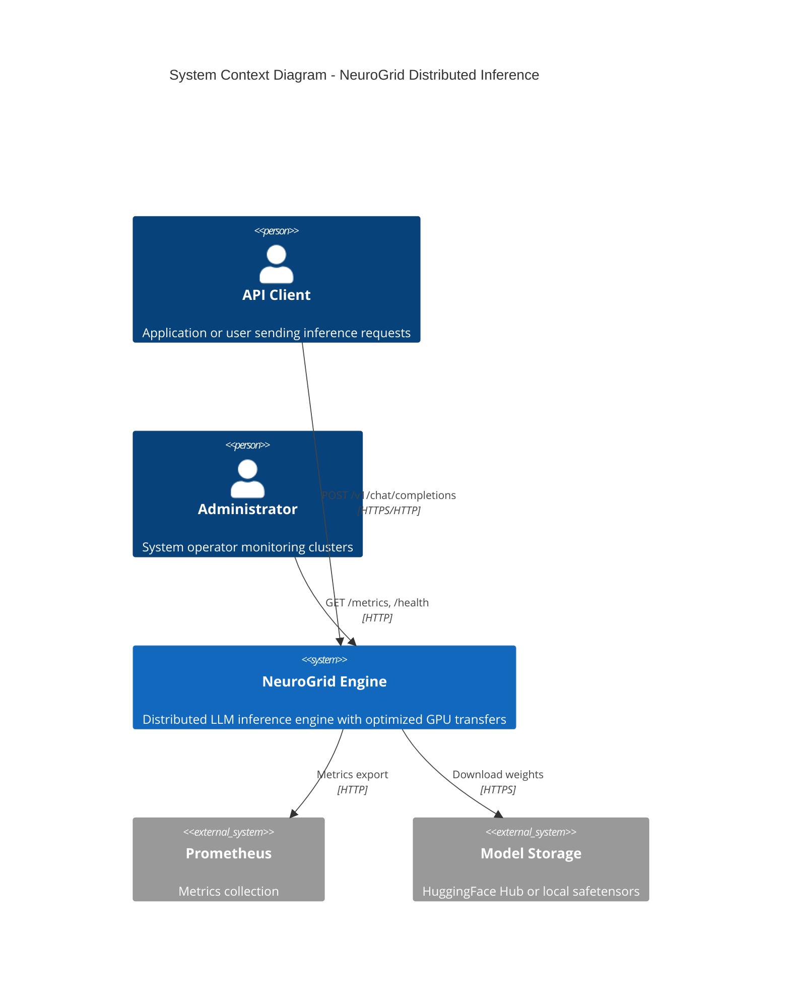
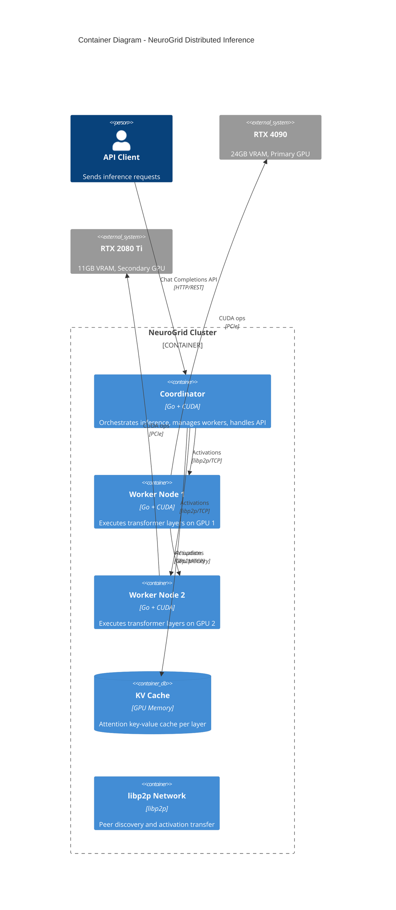
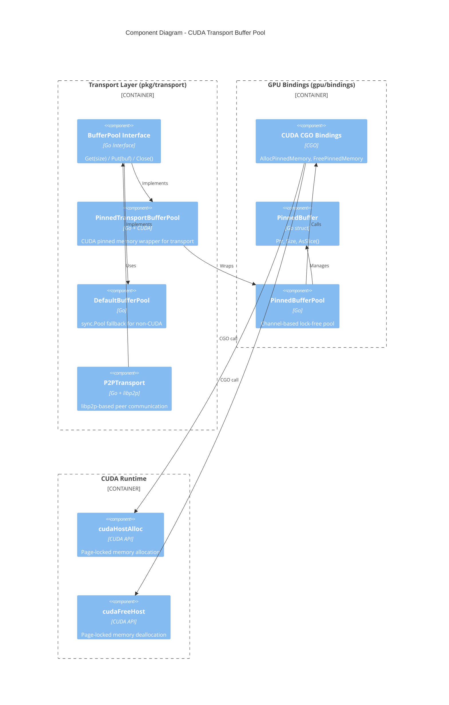
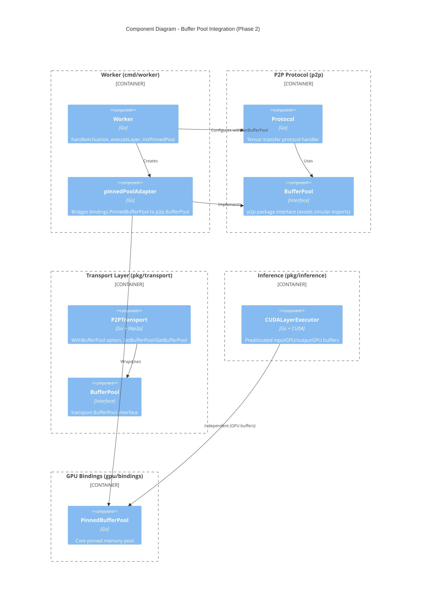
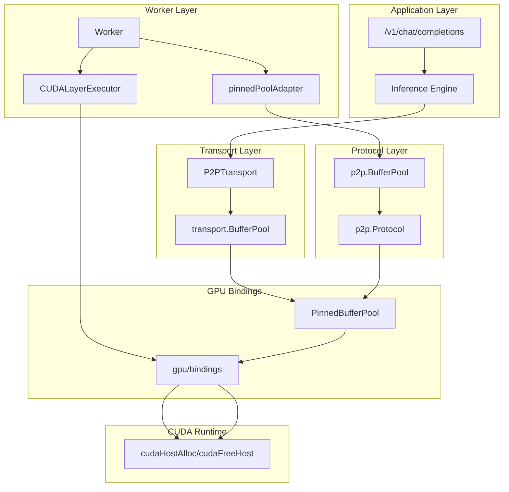
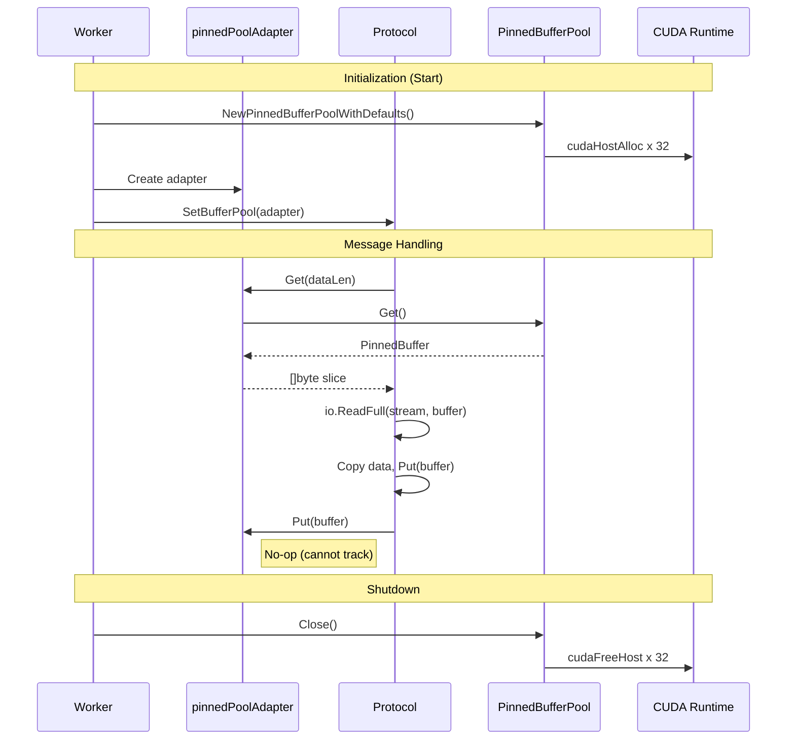

# C4 Diagram: CUDA Transport Optimization

## Overview

This document describes the architecture of the CUDA Transport Optimization feature using C4 model diagrams. The feature implements CUDA pinned memory buffer pools to optimize activation transfers in distributed LLM inference.

## C4 Context Diagram

Shows the NeuroGrid system in context with external users and systems.



## C4 Container Diagram

Shows the major containers within the NeuroGrid system.



## C4 Component Diagram - Buffer Pool System

Detailed view of the buffer pool components within a worker node.



## C4 Component Diagram - Phase 2 Integration

Shows buffer pool integration points across all components (Phase 2 implementation).



## Component Details

### BufferPool Interface

```go
type BufferPool interface {
    Get(size int) []byte  // Returns buffer of at least size bytes
    Put(buf []byte)       // Returns buffer to pool for reuse
    Close() error         // Releases all pooled resources
}
```

### PinnedTransportBufferPool

Wraps `bindings.PinnedBufferPool` for transport layer use:

| Field | Type | Purpose |
|-------|------|---------|
| pool | *bindings.PinnedBufferPool | Underlying CUDA pinned pool |
| bufSize | int | Size of each buffer |
| bufMap | map[uintptr]*PinnedBuffer | Maps slice ptr to PinnedBuffer |
| closed | bool | Closed state flag |

### PinnedBufferPool (bindings)

Channel-based lock-free buffer management:

| Field | Type | Purpose |
|-------|------|---------|
| buffers | chan *PinnedBuffer | Lock-free buffer channel |
| bufSize | uint64 | Buffer size (16KB default) |
| count | int | Pool capacity (32 default) |

### pinnedPoolAdapter (Worker)

Bridges bindings and p2p package interfaces:

| Method | Behavior | Notes |
|--------|----------|-------|
| Get(size) | Returns buffer from pool or allocates fallback | Falls back to make([]byte) |
| Put(buf) | No-op (cannot track slice->PinnedBuffer mapping) | Memory managed by pool/GC |
| Close() | Closes underlying PinnedBufferPool | Frees CUDA pinned memory |

### CUDA Bindings

| Function | CUDA API | Purpose |
|----------|----------|---------|
| AllocPinnedMemory | cudaHostAlloc | Allocate page-locked memory |
| FreePinnedMemory | cudaFreeHost | Free page-locked memory |
| IsPinnedMemory | cudaHostGetFlags | Check if memory is pinned |

## Integration Points (Phase 2)



## Thread Safety

All components are thread-safe:

| Component | Mechanism |
|-----------|-----------|
| PinnedBufferPool | Channel-based (lock-free) |
| PinnedTransportBufferPool | sync.RWMutex for bufMap |
| DefaultBufferPool | sync.Pool (lock-free) |
| Protocol.bufferPool | sync.RWMutex |
| P2PTransport.bufferPool | sync.Mutex (via SetBufferPool) |
| CUDALayerExecutor | sync.RWMutex |

## Configuration

| Constant | Value | Purpose |
|----------|-------|---------|
| DefaultPinnedBufferSize | 16KB | Covers Llama 7B (8KB), 13B (10KB) |
| DefaultPinnedPoolCount | 32 | Concurrent request handling |
| DefaultTransportBufferSize | 16KB | Transport layer default |
| DefaultTransportPoolSize | 32 | Transport pool capacity |

## Buffer Flow Summary


