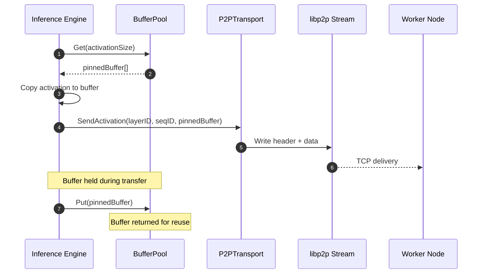
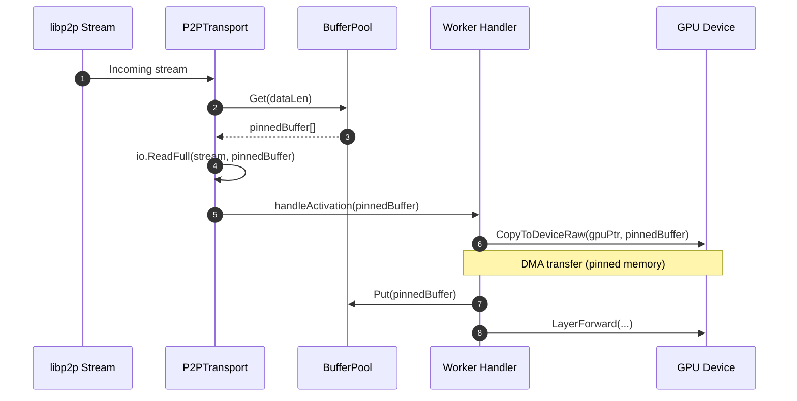
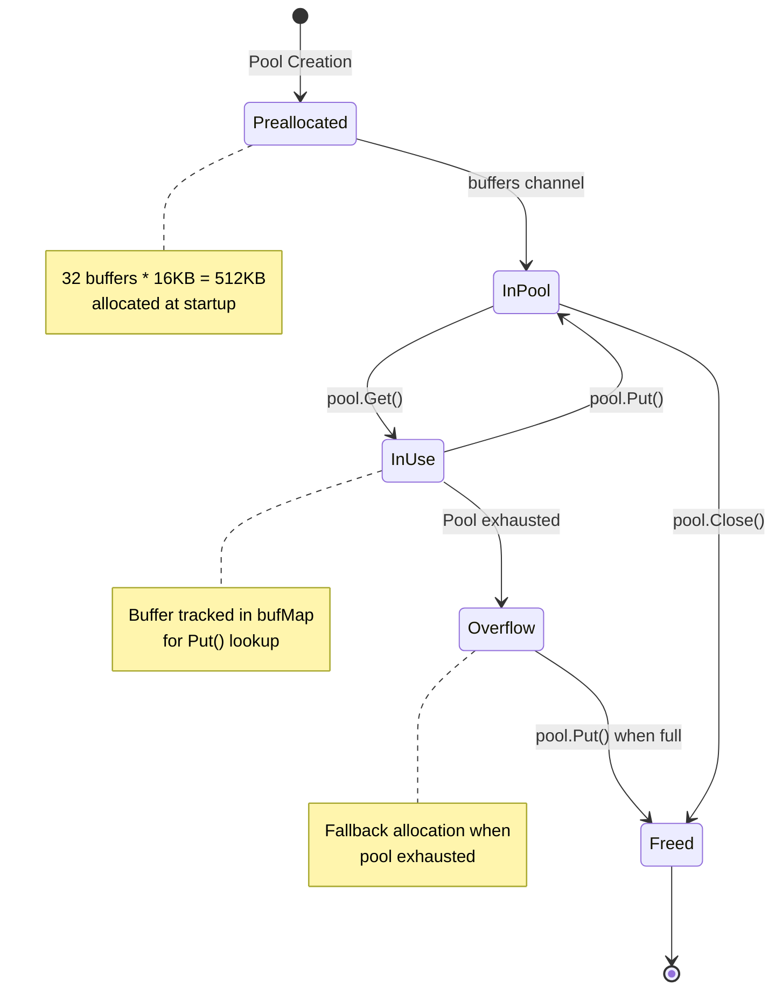
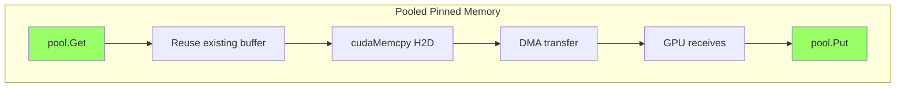
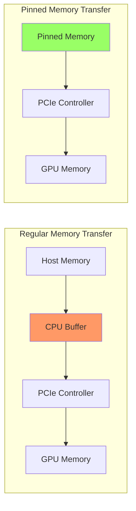
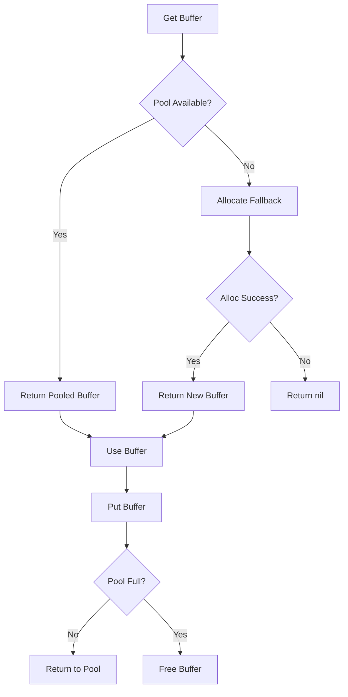
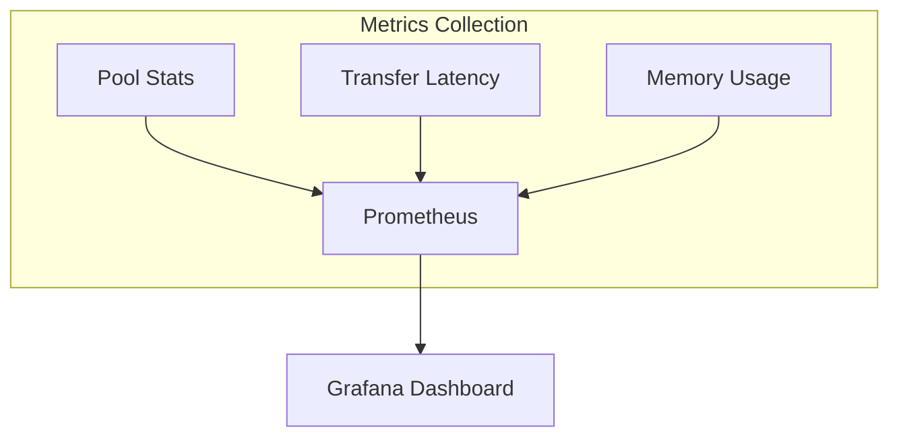

# Data Flow Diagram: Activation Transfer with Pinned Memory

## Overview

This document describes the data flow for activation transfers in distributed LLM inference using CUDA pinned memory buffers. The optimization eliminates per-transfer allocations and enables DMA transfers for improved latency.

## High-Level Data Flow

```mermaid
flowchart LR
    subgraph Coordinator["Coordinator Node"]
        A[Token Input] --> B[Embedding Lookup]
        B --> C[Layer Forward]
        C --> D[Buffer Pool Get]
        D --> E[Serialize Activation]
    end

    subgraph Network["libp2p Network"]
        E --> F[TCP Stream]
    end

    subgraph Worker["Worker Node"]
        F --> G[Buffer Pool Get]
        G --> H[Deserialize]
        H --> I[GPU Transfer]
        I --> J[Layer Forward]
        J --> K[Serialize Result]
        K --> L[Buffer Pool Put]
    end

    subgraph Response["Response Path"]
        L --> M[TCP Stream]
        M --> N[Buffer Pool Put]
        N --> O[Continue Pipeline]
    end
```



## Detailed Activation Transfer Flow

### 1. Outbound Transfer (Coordinator to Worker)



### 2. Inbound Transfer (Worker Receive)



## Buffer Lifecycle



## Memory Flow Comparison

### Before Optimization (Regular Memory)

```mermaid
flowchart TB
    subgraph "Per-Transfer Allocation"
        A1[make[]byte, dataLen] --> B1[CPU copies data]
        B1 --> C1[cudaMemcpy H2D]
        C1 --> D1[CPU involved in copy]
        D1 --> E1[GPU receives]
        E1 --> F1[GC collects buffer]
    end

    style A1 fill:#f96
    style F1 fill:#f96
```

### After Optimization (Pinned Memory)



## Data Transformation Steps

| Step | Input | Process | Output | Memory Type |
|------|-------|---------|--------|-------------|
| 1 | Token IDs | Embedding lookup | Hidden state FP16 | GPU Memory |
| 2 | Hidden state | Layer forward | Activation FP16 | GPU Memory |
| 3 | Activation | GPU to Host copy | Byte slice | Pinned Memory |
| 4 | Byte slice | Network transfer | TCP packets | Pinned Memory |
| 5 | TCP packets | Reassembly | Byte slice | Pinned Memory |
| 6 | Byte slice | Host to GPU copy | Activation FP16 | GPU Memory |
| 7 | Activation | Layer forward | Hidden state FP16 | GPU Memory |

## Transfer Size Analysis

For Llama models over Gigabit Ethernet:

| Model | Hidden Size | Transfer Size (FP16) | Theoretical Time |
|-------|-------------|---------------------|------------------|
| Llama 7B | 4096 | 8 KB | ~64 us |
| Llama 13B | 5120 | 10 KB | ~80 us |
| Llama 30B | 6656 | 13 KB | ~104 us |
| Llama 65B | 8192 | 16 KB | ~128 us |

Note: Actual latency includes protocol overhead and GPU transfer time.

## Pinned Memory DMA Benefits



**Key Difference**: Pinned memory bypasses CPU buffer, enabling Direct Memory Access.

## Error Handling Flow



## Metrics and Observability

### Key Metrics

| Metric | Type | Description |
|--------|------|-------------|
| buffer_pool_available | Gauge | Buffers available in pool |
| buffer_pool_capacity | Gauge | Total pool capacity |
| buffer_pool_misses | Counter | Fallback allocations |
| transfer_latency_ms | Histogram | End-to-end transfer time |
| dma_transfer_bytes | Counter | Bytes transferred via DMA |

### Monitoring Points


