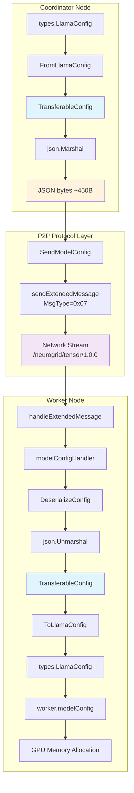
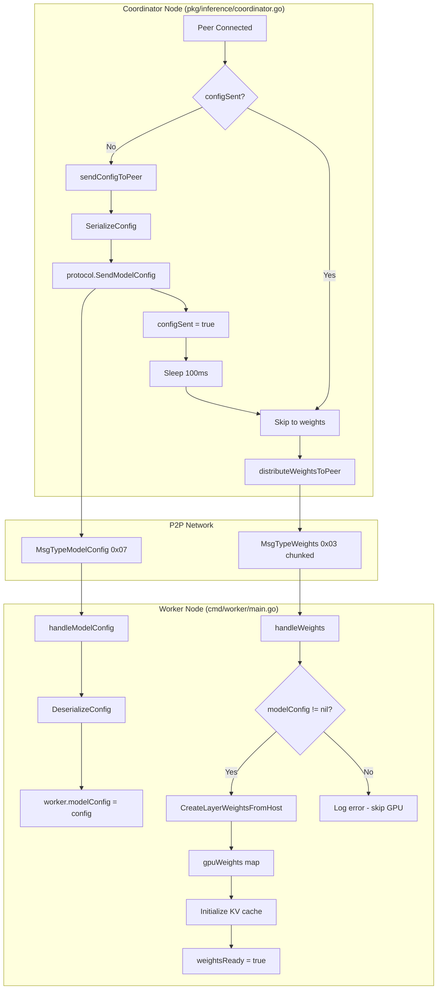
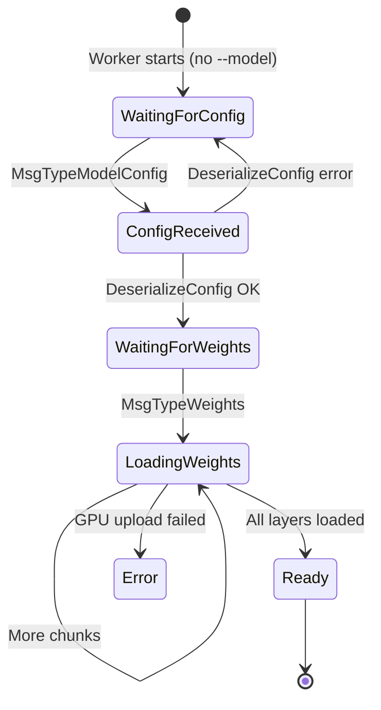
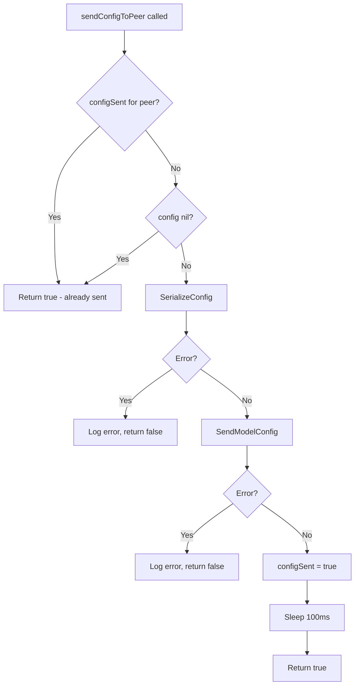
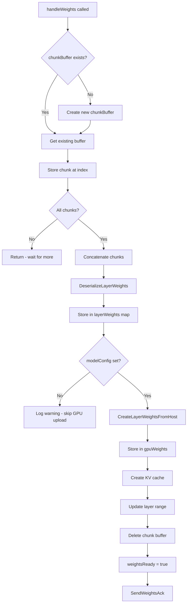

# Data Flow Diagram: TransferableConfig Lifecycle

## Overview

This diagram shows how model configuration data flows through the system, from the coordinator's loaded model to the worker's GPU memory allocation. The TransferableConfig struct serves as the wire format for P2P transfer.

## Diagram



## Complete Initialization Flow



## Data Flow Steps

| Step | Input | Process | Output |
|------|-------|---------|--------|
| 1 | LlamaConfig | FromLlamaConfig() | TransferableConfig |
| 2 | TransferableConfig | json.Marshal() | JSON bytes |
| 3 | JSON bytes | SendModelConfig() | P2P stream |
| 4 | P2P stream | handleExtendedMessage() | Raw bytes |
| 5 | Raw bytes | json.Unmarshal() | TransferableConfig |
| 6 | TransferableConfig | ToLlamaConfig() | LlamaConfig |
| 7 | LlamaConfig | GPU init | Allocated buffers |

## Data Transformations

### Coordinator Side (Serialization)

```go
// Input: types.LlamaConfig from model loader
config := &types.LlamaConfig{
    HiddenSize:       4096,
    IntermediateSize: 14336,
    NumLayers:        32,
    // ...
}

// Transform to wire format
tc := inference.FromLlamaConfig(config, "mistral-7b")

// Output: JSON bytes
// {"model_name":"mistral-7b","hidden_size":4096,...}
data, _ := json.Marshal(tc)
```

### Wire Format

```
Extended Header (25 bytes):
+--------+----------+--------+------------+----------+
| MsgType| LayerID  | SeqID  | RequestID  | DataLen  |
| 0x07   | 0        | 0      | 0          | ~450     |
+--------+----------+--------+------------+----------+
| 1B     | 4B       | 8B     | 8B         | 4B       |
+--------+----------+--------+------------+----------+

JSON Payload (~450 bytes):
{
  "model_name": "mistral-7b-instruct",
  "hidden_size": 4096,
  "intermediate_size": 14336,
  "num_layers": 32,
  "num_heads": 32,
  "num_kv_heads": 8,
  "head_dim": 128,
  "vocab_size": 32000,
  "max_seq_len": 4096,
  "rms_norm_eps": 0.000001
}
```

### Worker Side (Deserialization)

```go
// Input: JSON bytes from P2P
// {"model_name":"mistral-7b","hidden_size":4096,...}

// Transform from wire format
config, modelName, _ := inference.DeserializeConfig(data)

// Output: types.LlamaConfig for GPU operations
// Used by handleWeights() for:
// - layer_weights allocation
// - KV cache sizing
// - attention buffer allocation
```

## State Diagram



## Coordinator sendConfigToPeer Flow



## Weight Handling Data Flow



## Error Handling

| Error | Location | Cause | Recovery |
|-------|----------|-------|----------|
| ErrNilConfig | Coordinator | Nil LlamaConfig passed | Return error, don't send |
| ErrEmptyModelName | Coordinator | Empty model name | Return error, don't send |
| ErrEmptyData | Worker | Zero-length payload | Log error, ignore message |
| ErrNullConfig | Worker | JSON literal "null" | Log error, ignore message |
| json.SyntaxError | Worker | Malformed JSON | Log error, ignore message |
| modelConfig nil | Worker handleWeights | Config not yet received | Log warning, skip GPU upload |

## Invariants

1. **Config size < 1KB**: TransferableConfig JSON never exceeds 1KB (single message)
2. **All fields required**: No optional fields in TransferableConfig
3. **Lossless round-trip**: FromLlamaConfig -> ToLlamaConfig preserves all values
4. **Config precedes weights**: modelConfig must be set before handleWeights() can upload to GPU
5. **100ms delay**: Coordinator sleeps 100ms after config to ensure worker processes it

## Files

| File | Responsibility |
|------|----------------|
| `pkg/types/config.go` | LlamaConfig definition |
| `pkg/inference/config_transfer.go` | TransferableConfig + serialization |
| `pkg/inference/coordinator.go` | sendConfigToPeer, configSent tracking |
| `p2p/protocol.go` | Wire format and message routing |
| `cmd/worker/main.go` | handleModelConfig, handleWeights |

## Related Documentation

- [ADR-006: Config Transfer Protocol](../decisions/ADR-006-config-transfer-protocol.md)
- [Sequence Diagram: Config Transfer](sequence-config-transfer.md)
- [Sequence Diagram: Worker Modes](sequence-worker-modes.md)
- [C4 Component Diagram](c4-component-distributed-inference.md)

---

*Updated 2025-01-24 - Added Phase 3-5 implementation details (coordinator sendConfigToPeer, worker handleWeights flow)*
