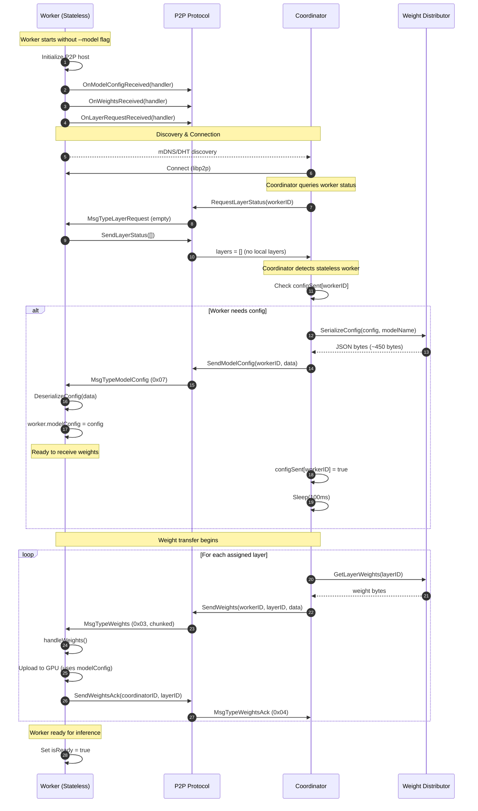
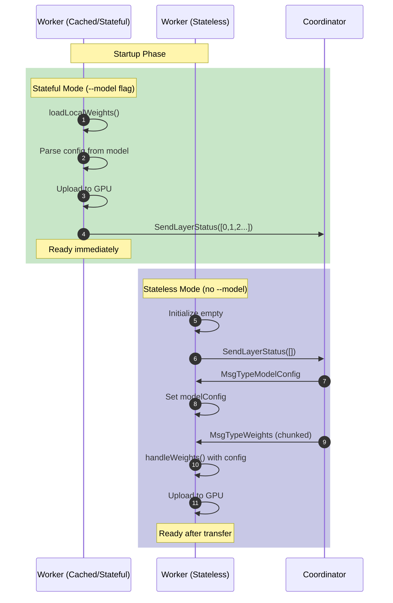
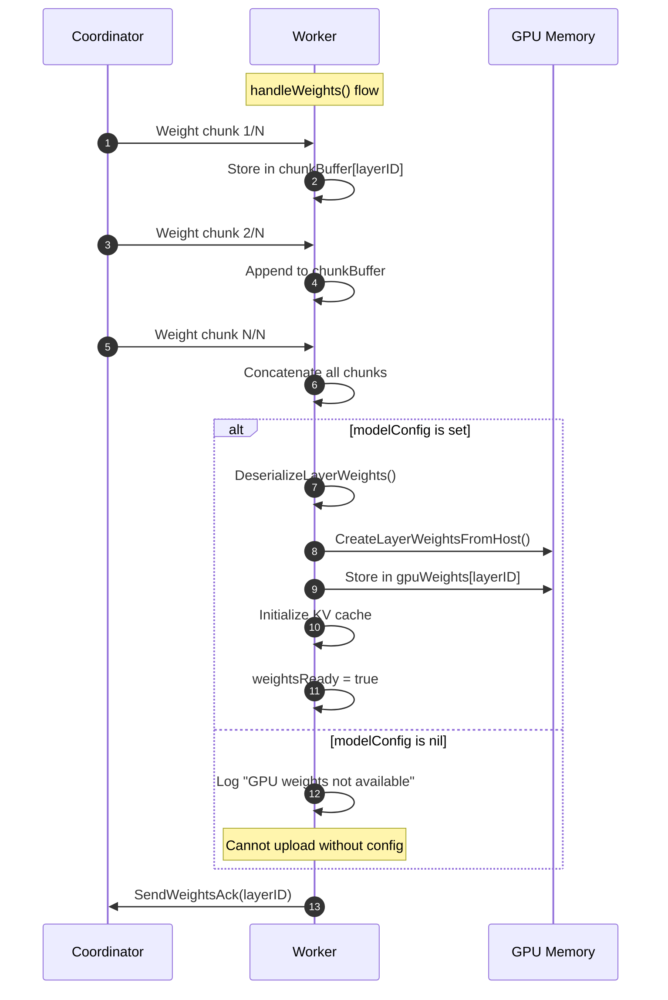

# Sequence Diagram: Config Transfer for Stateless Workers

## Overview

This diagram shows the complete flow when a stateless worker (without local model files) joins the distributed inference cluster. The coordinator detects the worker lacks configuration and sends it before weight transfer.

## Primary Flow: Stateless Worker Initialization

## Worker Mode Comparison

## Weight Handling with Config

## Steps

| Step | Actor | Action | Description |
|------|-------|--------|-------------|
| 1 | Worker | Initialize P2P host | Create libp2p node without model files |
| 2-4 | Worker | Register handlers | Set up callbacks for config, weights, layer requests |
| 5-6 | Both | Discovery | Peer discovery via mDNS or DHT |
| 7-10 | Coordinator | Query layer status | Check what layers worker has locally |
| 11-17 | Coordinator | Send config | If worker has no layers, send model config |
| 18-24 | Both | Weight transfer | Send layer weights with chunking |
| 25 | Worker | Ready state | Worker can now process inference requests |

## Error Scenarios

| Scenario | Trigger | Response |
|----------|---------|----------|
| Config deserialization fails | Malformed JSON | Worker logs error, stays in waiting state |
| Config arrives after weights | Race condition | Weights dropped, logged as "GPU weights not available" |
| Worker disconnect during transfer | Network failure | Coordinator retries on reconnect |
| Timeout waiting for layer status | Slow worker | Coordinator uses default (assume stateless) |

## Key Design Decisions

1. **Config before weights**: The 100ms sleep after config ensures worker processes config before weight chunks arrive.

2. **Empty layer request triggers status**: Coordinator sends empty layer request to get worker's current status.

3. **configSent tracking**: Prevents duplicate config sends if worker reconnects.

4. **Chunk buffering**: Worker accumulates all chunks before attempting deserialization and GPU upload.

## Files Involved

| File | Role |
|------|------|
| `p2p/protocol.go` | Message routing and handlers |
| `pkg/inference/config_transfer.go` | JSON serialization/deserialization |
| `pkg/inference/coordinator.go` | Config sending logic, configSent tracking |
| `cmd/worker/main.go` | Config receiving, handleModelConfig, handleWeights |

## Related Documentation

- [ADR-006: Config Transfer Protocol](../decisions/ADR-006-config-transfer-protocol.md)
- [Data Flow: Config Transfer](data-flow-config-transfer.md)
- [Worker Architecture](sequence-worker-modes.md)

---

*Updated 2025-01-24 - Added Phase 3-5 implementation details*
