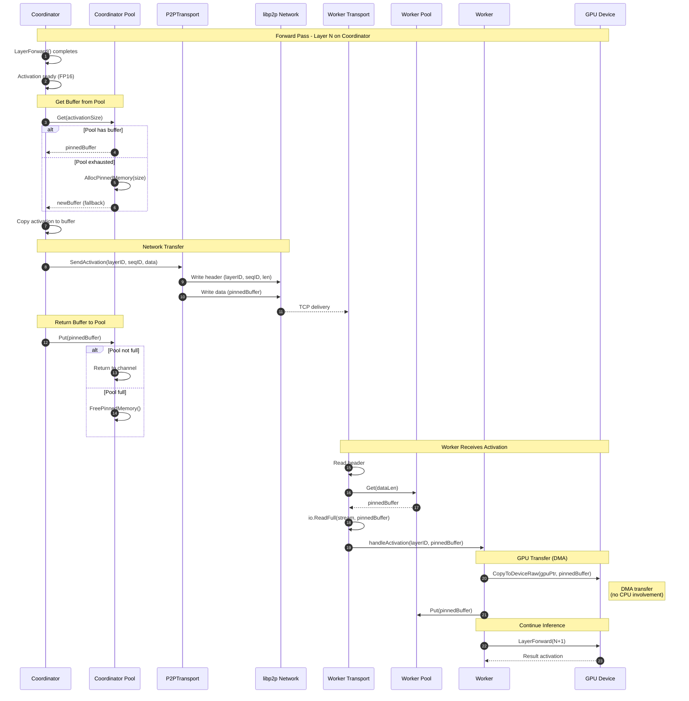
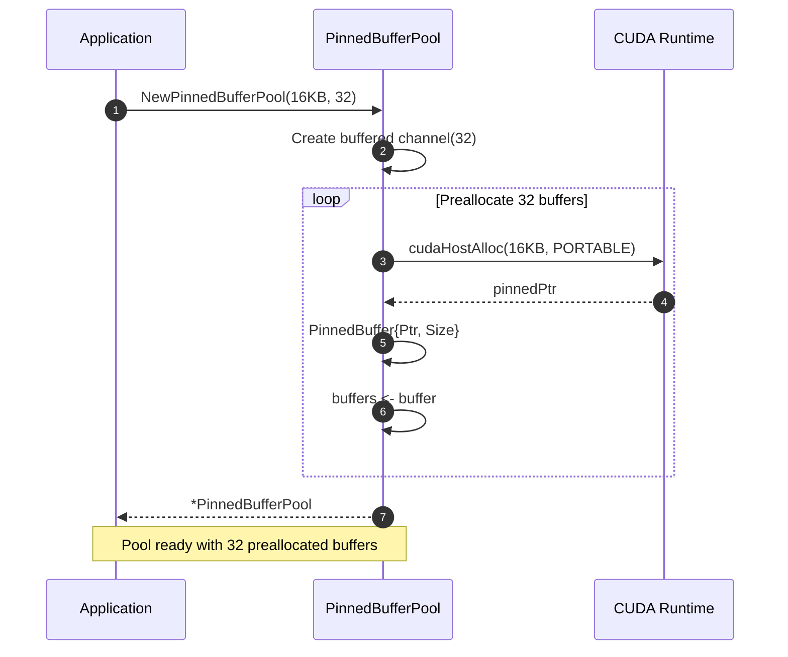
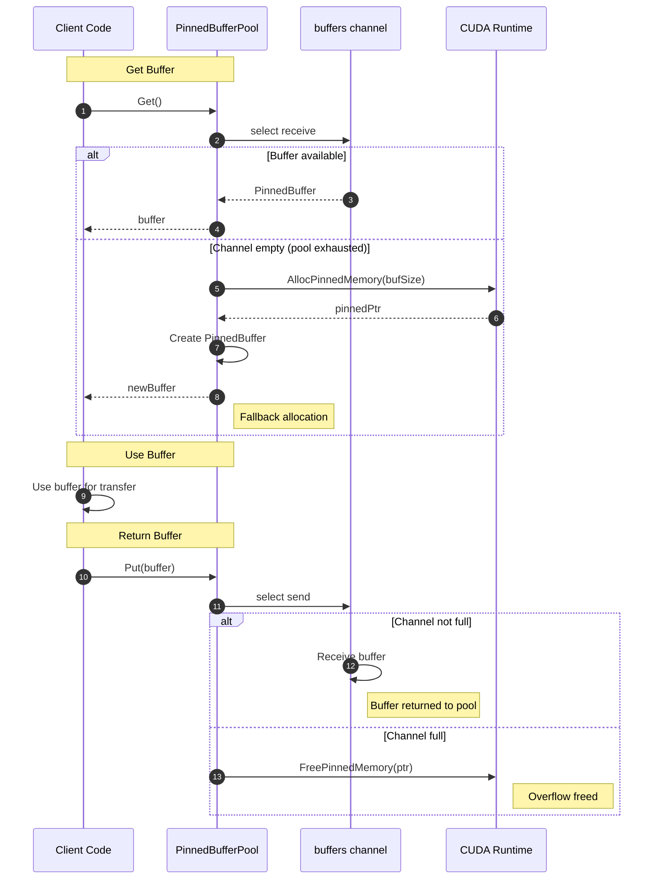
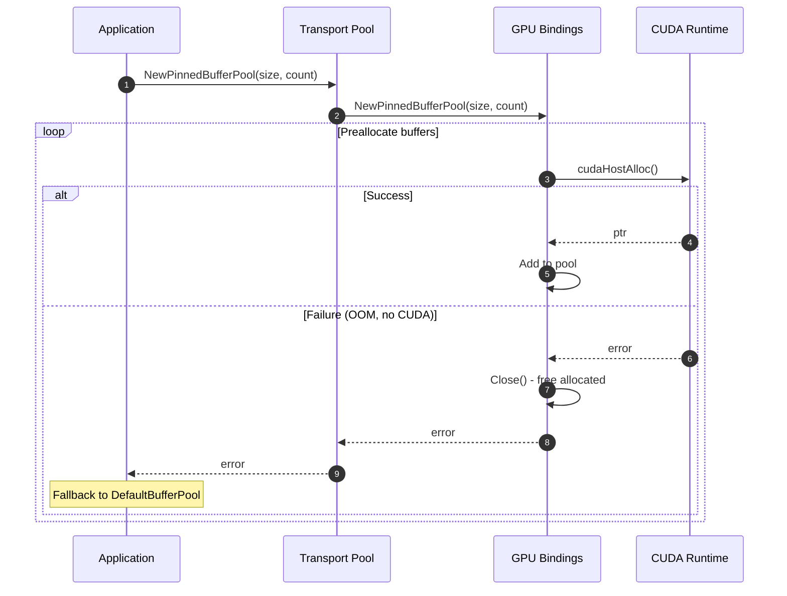
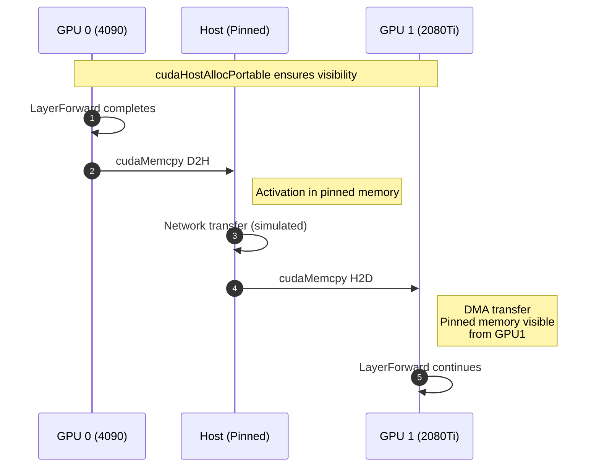
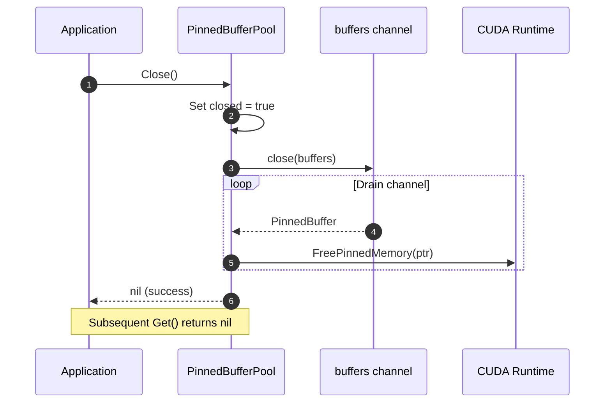
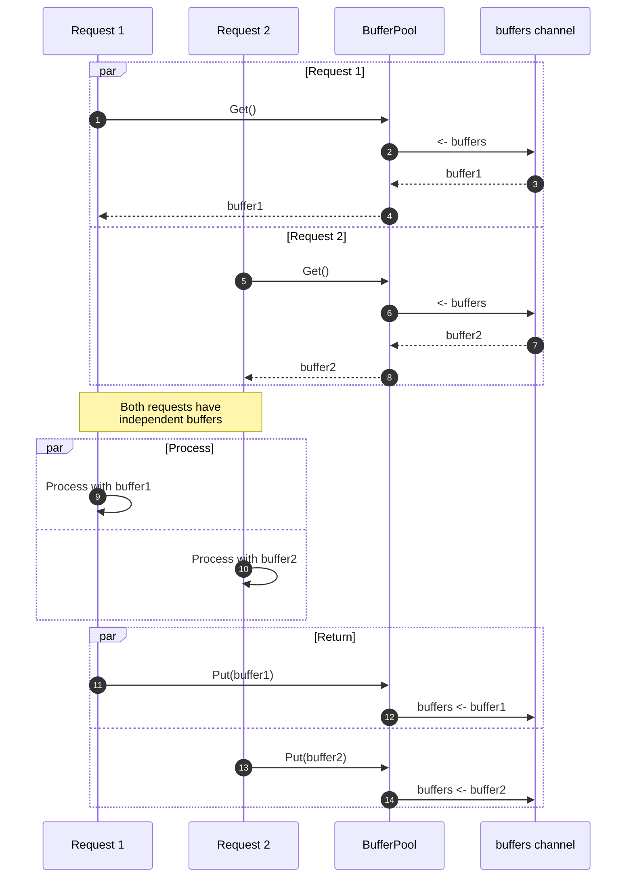

# Sequence Diagram: Pinned Memory Activation Transfer

## Overview

This document describes the sequence of operations for activation transfers using CUDA pinned memory in distributed LLM inference.

## Main Flow: Coordinator to Worker Transfer

## Buffer Pool Initialization

## Buffer Get/Put Cycle

## Error Handling: Allocation Failure

## Multi-GPU Transfer with Pinned Memory

## Pool Shutdown Sequence

## Concurrent Request Handling

## Performance Timeline Comparison

```mermaid
gantt
    title Transfer Latency Comparison (64KB)
    dateFormat X
    axisFormat %L ms

    section Regular Memory
    Allocate buffer     :a1, 0, 50
    Copy to buffer      :a2, after a1, 30
    CPU staging copy    :a3, after a2, 100
    PCIe transfer       :a4, after a3, 150
    Free buffer (GC)    :a5, after a4, 20

    section Pinned Memory
    Pool Get            :b1, 0, 5
    Copy to buffer      :b2, after b1, 30
    DMA transfer        :b3, after b2, 120
    Pool Put            :b4, after b3, 5
```

## Key Observations

1. **Lock-free Pool Access**: Channel-based design enables concurrent Get/Put without locks
2. **DMA Benefit**: Pinned memory bypasses CPU staging buffer
3. **Graceful Fallback**: Pool exhaustion triggers allocation, not failure
4. **Multi-GPU Visibility**: `cudaHostAllocPortable` flag enables cross-device DMA
5. **Clean Shutdown**: Close() drains and frees all buffers safely
