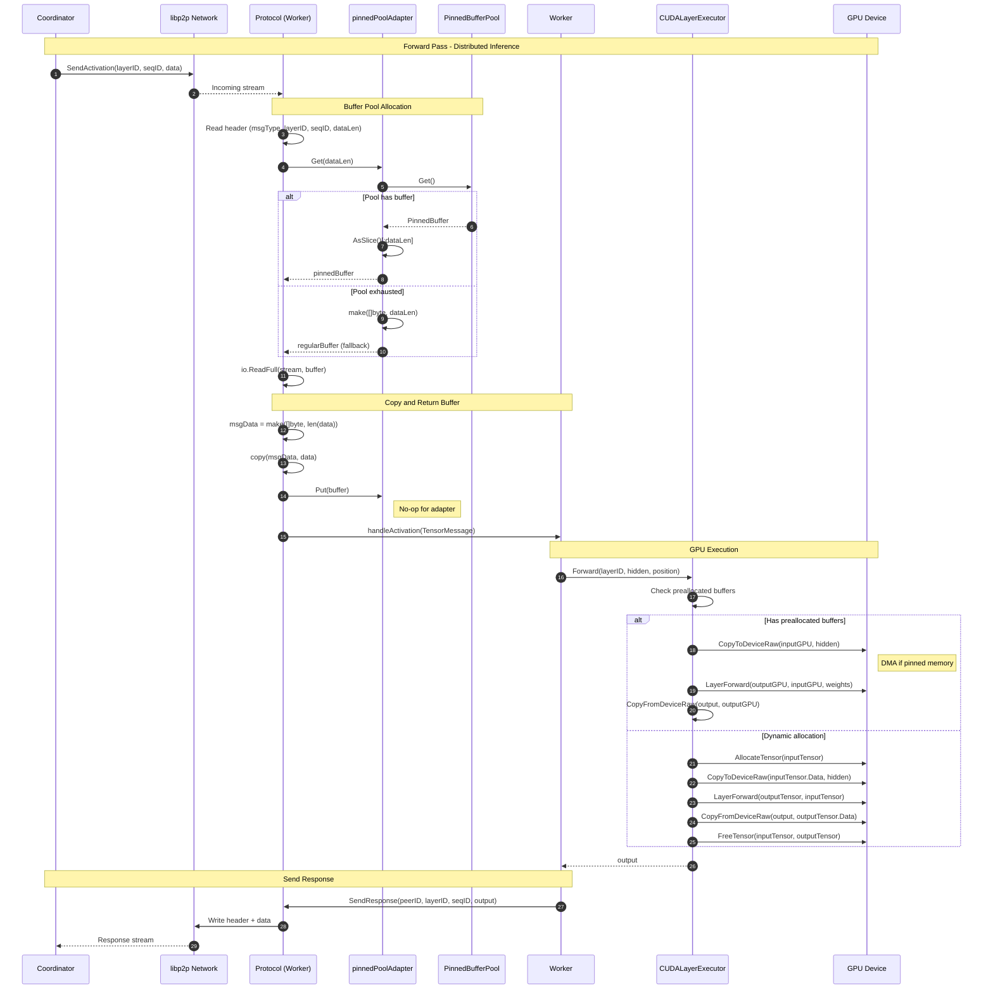
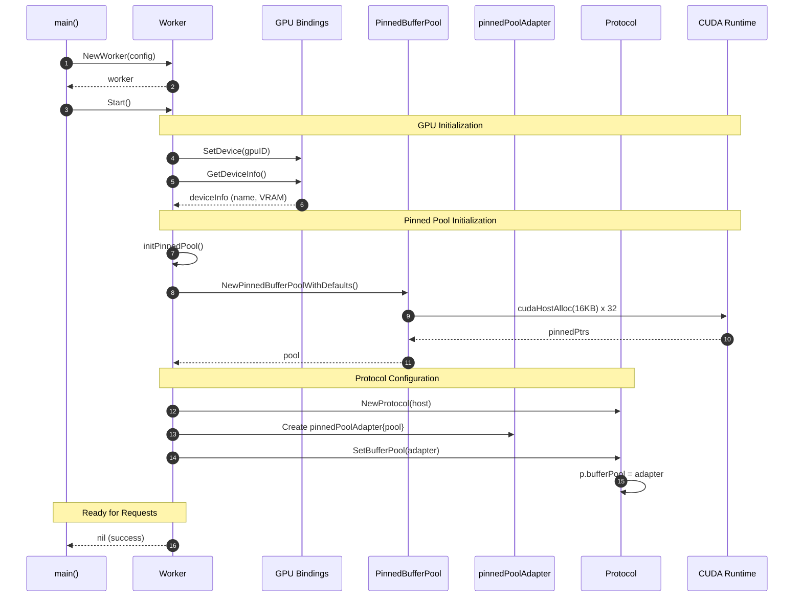
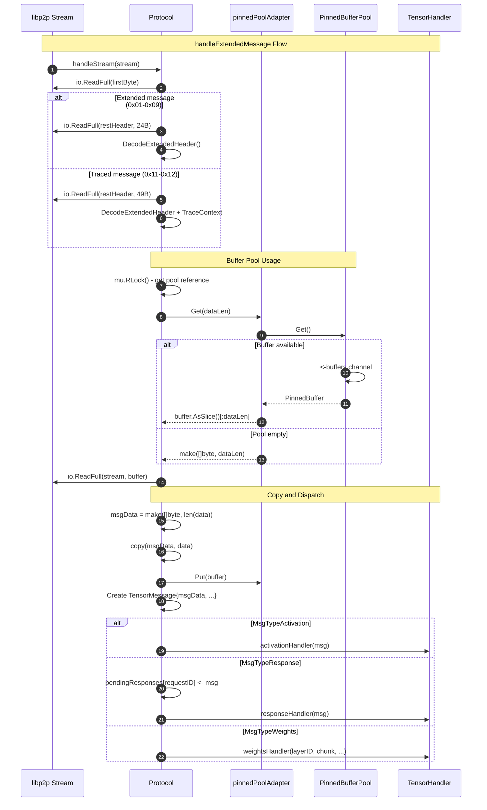
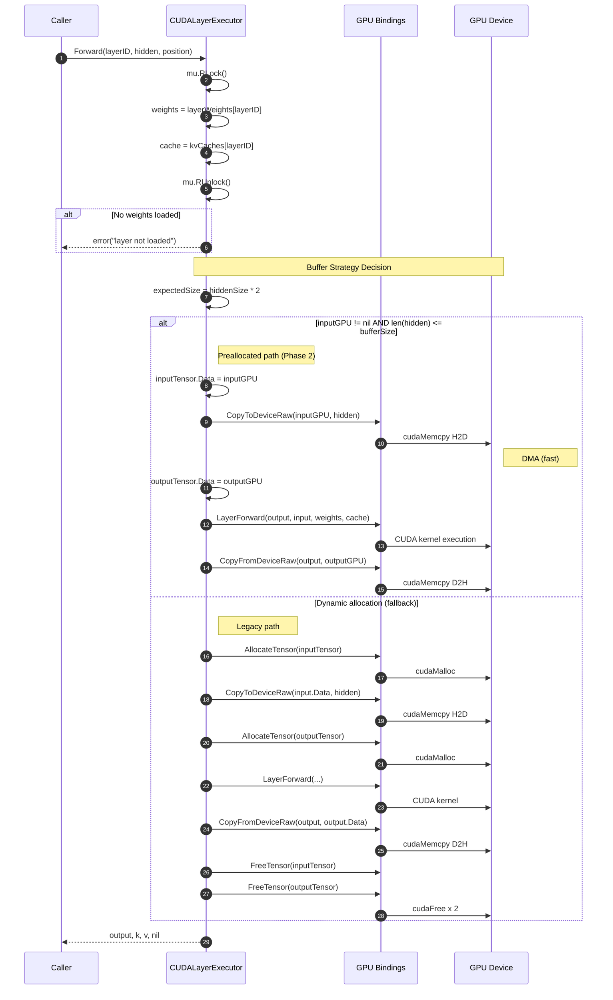
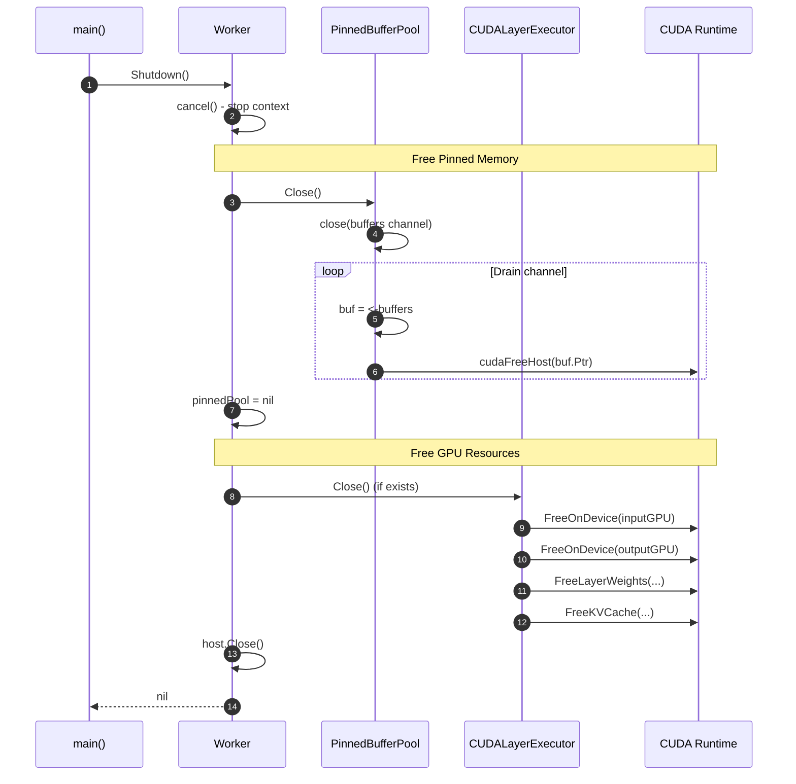

# Sequence Diagram: Transport Buffer Flow (Phase 2)

## Overview

This document describes the end-to-end flow of activation data through the transport layer using buffer pools, from Coordinator to Worker to GPU. This represents the Phase 2 integration of CUDA pinned memory optimization.

## End-to-End Flow: Coordinator to Worker GPU

## Worker Initialization Flow

## Protocol Message Handling Detail

## CUDALayerExecutor Forward Flow

## Shutdown Flow

## Performance Comparison

```mermaid
gantt
    title Transfer Path Latency Comparison
    dateFormat X
    axisFormat %L ms

    section Without Pools
    make([]byte, dataLen)     :a1, 0, 30
    io.ReadFull               :a2, after a1, 100
    copy(msgData, data)       :a3, after a2, 20
    cudaMemcpy H2D (staged)   :a4, after a3, 150
    cudaMalloc (input)        :a5, after a4, 80
    cudaMalloc (output)       :a6, after a5, 80
    LayerForward              :a7, after a6, 200
    cudaFree x2               :a8, after a7, 60
    GC pressure               :a9, after a8, 50

    section With Pools (Phase 2)
    pool.Get()                :b1, 0, 5
    io.ReadFull (pinned)      :b2, after b1, 100
    copy(msgData, data)       :b3, after b2, 20
    cudaMemcpy H2D (DMA)      :b4, after b3, 120
    Use preallocated GPU      :b5, after b4, 5
    LayerForward              :b6, after b5, 200
    pool.Put() (no-op)        :b7, after b6, 1
```

## Key Integration Points

| Component | Buffer Pool Integration | Notes |
|-----------|------------------------|-------|
| Protocol.handleExtendedMessage | Uses p.bufferPool.Get/Put | Copies data before Put |
| Protocol.handleTracedMessage | Uses p.bufferPool.Get/Put | Same pattern as extended |
| P2PTransport.handleExtendedStream | Uses t.bufferPool.Get/Put | transport package version |
| P2PTransport.handleLegacyStream | Uses t.bufferPool.Get/Put | Backward compatible |
| CUDALayerExecutor.Forward | Reuses inputGPU/outputGPU | GPU-side optimization |
| Worker.initPinnedPool | Creates PinnedBufferPool | Called during GPU init |
| Worker.Shutdown | Closes PinnedBufferPool | Frees CUDA pinned memory |
