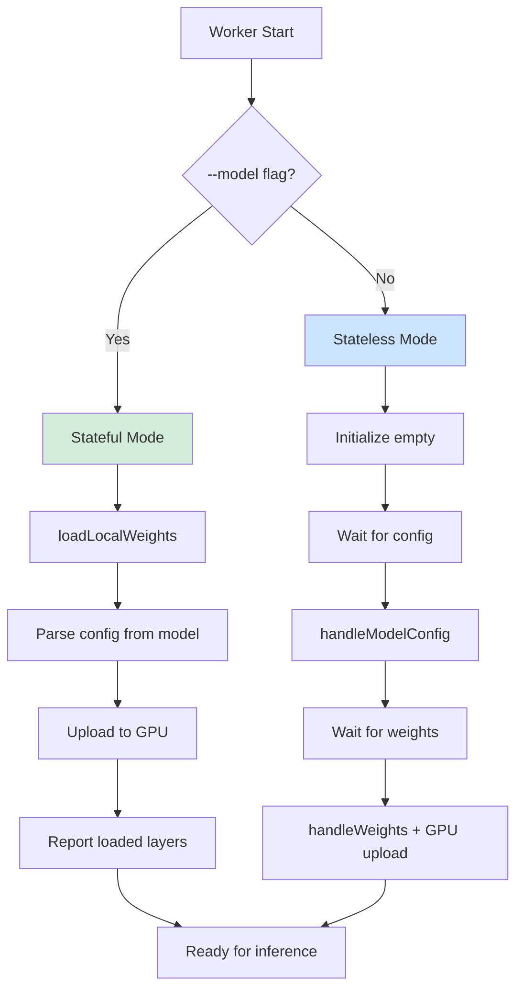
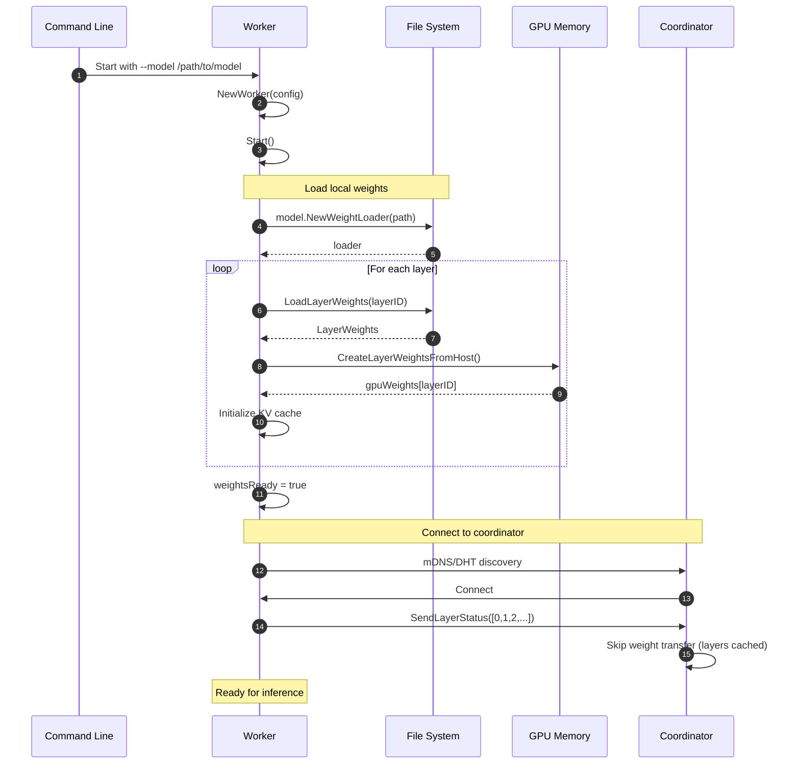
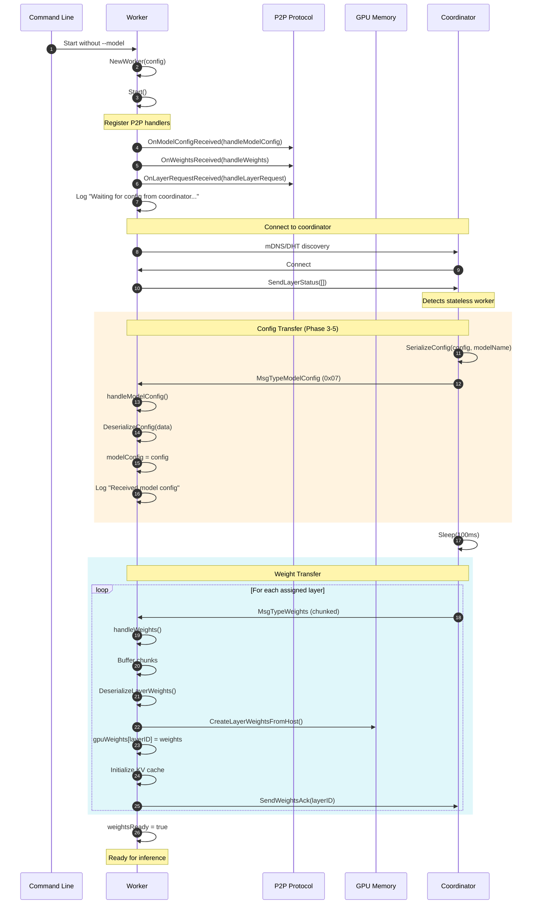
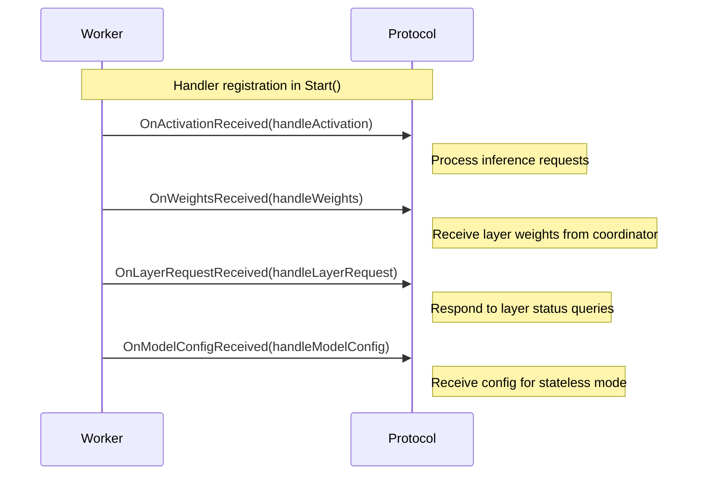
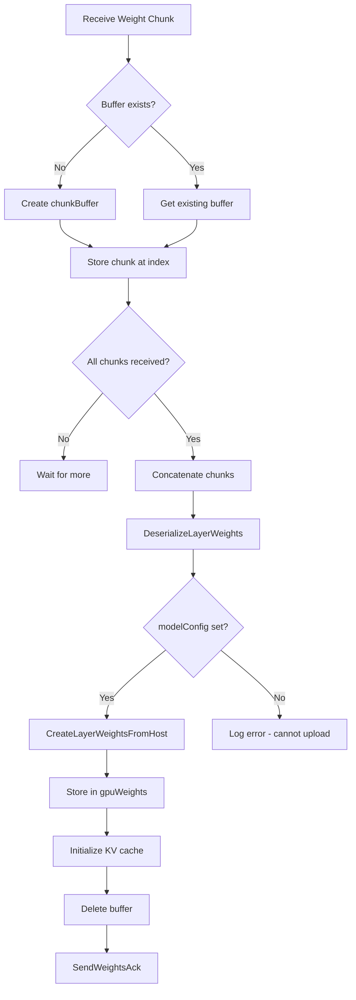

# Sequence Diagram: Worker Operation Modes

## Overview

NeuroGrid workers can operate in two modes: stateful (with local model files) or stateless (receiving config and weights from coordinator). This document describes both modes and their initialization sequences.

## Worker Mode Decision Flow

## Stateful Mode (Local Model)

## Stateless Mode (Remote Config + Weights)

## Handler Registration

## Key Components

### Worker State Fields

| Field | Type | Purpose |
|-------|------|---------|
| `modelConfig` | `*types.LlamaConfig` | Model configuration (set by local load or received) |
| `layerWeights` | `map[int]*LayerWeights` | CPU layer weights |
| `gpuWeights` | `map[int]*bindings.LayerWeights` | GPU layer weights |
| `gpuKVCaches` | `map[int]*bindings.KVCache` | KV cache per layer |
| `weightsReady` | `bool` | Flag indicating ready for inference |
| `chunkBuffers` | `map[int]*chunkBuffer` | Accumulates weight chunks |
| `startLayerID` | `int` | First layer this worker handles |
| `endLayerID` | `int` | Last layer this worker handles |

### Handler Functions

| Handler | Message Type | Purpose |
|---------|-------------|---------|
| `handleActivation` | `MsgTypeActivation` | Process layer forward pass |
| `handleWeights` | `MsgTypeWeights` | Receive and upload weights to GPU |
| `handleLayerRequest` | `MsgTypeLayerRequest` | Report loaded layers to coordinator |
| `handleModelConfig` | `MsgTypeModelConfig` | Set model config for stateless mode |

## Chunk Buffer Flow

## Mode Comparison Table

| Aspect | Stateful Mode | Stateless Mode |
|--------|---------------|----------------|
| Startup | `--model /path` | No `--model` flag |
| Config source | Local model files | Coordinator (MsgTypeModelConfig) |
| Weight source | Local SafeTensors | Coordinator (MsgTypeWeights) |
| GPU upload | During startup | After receiving config + weights |
| Ready time | Fast (local I/O) | Slower (network transfer) |
| Disk usage | High (model files) | Low (no local model) |
| Use case | Primary nodes | Lightweight workers |

## Error Handling

| Error | Handler | Recovery |
|-------|---------|----------|
| Config deserialization failure | `handleModelConfig` | Log error, stay waiting |
| Weight deserialization failure | `handleWeights` | Log error, skip layer |
| GPU upload failure | `handleWeights` | Log error, continue (fail at execution) |
| No modelConfig when uploading | `handleWeights` | Skip GPU upload, log warning |

## Files Involved

| File | Components |
|------|------------|
| `cmd/worker/main.go` | Worker struct, handlers, Start() |
| `pkg/inference/config_transfer.go` | DeserializeConfig |
| `pkg/model/weights.go` | DeserializeLayerWeights |
| `gpu/bindings/layer.go` | CreateLayerWeightsFromHost |

---

*Created 2025-01-24 - Documents Phase 3-5 worker modes implementation*
